////
NO CAMBIAR!!
Codificación, idioma, tabla de contenidos, tipo de documento
////
:encoding: utf-8
:lang: es
:toc: right
:toc-title: Tabla de contenidos
:doctype: book
:icons: font
:source-highlighter: highlight.js
:copycss: true
:linkattrs:

////
Nombre y título del trabajo
////
# Desarrollo de una API REST para gestión de productos y valoraciones con FastAPI y MySQL
Departamento de Informática. Manuel Torres <mtorres@ual.es>

image::images/di.png[]

// NO CAMBIAR!! (Entrar en modo no numerado de apartados)
:numbered!: 

[abstract]
== Resumen
Este proyecto tiene como objetivo desarrollar una API REST eficiente y escalable para la gestión de productos y valoraciones en un entorno de comercio electrónico. Utilizando el framework FastAPI y MySQL, se busca proporcionar una solución flexible y robusta que permita a los desarrolladores crear aplicaciones modernas y de alto rendimiento. MySQL, con su capacidad de gestión de datos y su alto nivel de utilización en aplicaciones web, es una elección ideal para este tipo de proyectos. La implementación de esta API no solo facilitará la gestión de usuarios, productos y categorías, sino que también mejorará la experiencia del usuario al permitir la consulta y gestión de valoraciones y comentarios. Con un entorno de desarrollo configurado mediante Docker y Docker Compose, este proyecto ofrece una base sólida para futuras expansiones y mejoras. Con fines didácticos, se proporcionan ejemplos prácticos de uso de MySQL con Python y FastAPI, así como la interacción con la base de datos tanto mediante SQL directamente como a través de SQLAlchemy como ORM.

////
COLOCA A CONTINUACION LOS OBJETIVOS
////
.Objetivos

* Desarrollar una API REST utilizando el framework FastAPI y MySQL para gestionar usuarios, productos, categorías y valoraciones.
* Configurar un entorno de desarrollo utilizando Docker y Docker Compose.
* Implementar endpoints para la creación, consulta, actualización y eliminación de usuarios, productos, categorías y valoraciones.
* Proporcionar ejemplos prácticos de uso de MySQL con Python y FastAPI.
* Interactuar con la base de datos MySQL utilizando SQL directamente y mediante SQLAlchemy como ORM.
* Realizar pruebas de la API utilizando Postman.

[TIP]
====
Disponible el https://github.com/ualmtorres/FastAPIMySQLAPIProductosValoraciones.git[repositorio de GitHub] con el código fuente de la API REST.
====

:numbered:

## Introducción

En el contexto del comercio electrónico, la experiencia del usuario no solo depende de la disponibilidad de productos, sino también de la calidad de la información y las opiniones de otros compradores. Las valoraciones y comentarios juegan un papel crucial en la toma de decisiones de los clientes, ayudando a generar confianza y a mejorar los productos ofrecidos.

MySQL, como sistema de gestión de bases de datos relacional, ofrece una estructura robusta y eficiente para manejar datos estructurados, siendo una opción popular para aplicaciones web y comercio electrónico. En este tutorial se desarrollará una API REST que gestione usuarios, productos, categorías y valoraciones en un entorno de comercio electrónico.

## Descrición del problema

En este proyecto se va a desarrollar una API REST utilizando MySQL para gestionar usuarios, productos, categorías y valoraciones en un entorno de comercio electrónico utilizando el framework de Python https://fastapi.tiangolo.com/[FastAPI] y MySQL. La API debe permitir:
* La gestión de usuarios, incluyendo su creación, actualización, eliminación y consulta.
* La gestión de productos, incluyendo su creación, actualización, eliminación y consulta.
* La organización de productos en categorías con una estructura flexible.
* La gestión de valoraciones y comentarios de los usuarios sobre los productos.
* La consulta eficiente de productos con sus valoraciones agregadas.

## Configuración del entorno de desarrollo

Para configurar el entorno de desarrollo de la API REST, utilizaremos Docker y Docker Compose. El archivo `docker-compose.yml` define los servicios necesarios para ejecutar la aplicación, incluyendo MySQL y un contenedor de Python para ejecutar la API REST.

A continuación se muestra el contenido del archivo `docker-compose.yml`:

[source,yaml]
----
version: "3"
services:
  mysql:
    container_name: mysql
    image: mysql:8.0
    restart: always
    ports:
      - 3306:3306
    volumes:
      - "../data/mysql-data:/var/lib/mysql"
    environment:
      MYSQL_ROOT_PASSWORD: "${MYSQL_ROOT_PASSWORD}"
      MYSQL_DATABASE: "${MYSQL_DATABASE}"
      MYSQL_USER: "${MYSQL_USER}"
      MYSQL_PASSWORD: "${MYSQL_PASSWORD}"
    healthcheck:
      test:
        [
          "CMD",
          "mysqladmin",
          "ping",
          "-h",
          "localhost",
          "-u",
          "root",
          "-p${MYSQL_ROOT_PASSWORD}",
        ]
      interval: 10s
      timeout: 5s
      retries: 5
  python:
    depends_on:
      mysql:
        condition: service_healthy
    build:
      context: .
      dockerfile: Dockerfile
    volumes:
      - "../:/app"
    ports:
      - "8000:8000"
----

Se utiliza un archivo `.env` para definir las variables de entorno necesarias para la configuración de MySQL. A continuación se muestra el contenido del archivo `.env`:

[source,bash]
----
MYSQL_USER=example
MYSQL_PASSWORD=example
MYSQL_HOST=mysql
MYSQL_DATABASE=mydatabase
----

El archivo `Dockefile` se utiliza para construir el contenedor de Python con las dependencias necesarias para ejecutar la API REST. A continuación se muestra el contenido del archivo `Dockerfile`:

[source,docker]
----
FROM python:3.9-slim

WORKDIR /app

COPY ./requirements.txt /tmp/requirements.txt

RUN pip install -r /tmp/requirements.txt

COPY ../ ./

EXPOSE 8000

CMD [ "uvicorn", "main:app", "--host", "0.0.0.0", "--port", "8000", "--reload" ]
----

Como archivo de requisitos, se utiliza `requirements.txt` para instalar las dependencias necesarias para la API REST. A continuación se muestra el contenido del archivo `requirements.txt`:

[source,bash]
----
fastapi==0.95.2                 # Framework para construir APIs REST
uvicorn==0.22.0                 # Servidor ASGI para ejecutar aplicaciones FastAPI
sqlalchemy==2.0.23              # ORM para interactuar con bases de datos SQL
mysql-connector-python==8.1.0   # Conector de MySQL para Python
dotenv==0.9.9                   # Carga de variables de entorno desde un archivo .env
pydantic==1.10.7                # Biblioteca de validación de datos y serialización de objetos
pytz==2024.1                    # Biblioteca para manejar zonas horarias
----

### Servicios

- **mysql**: Servicio de bases de datos relacional que se utiliza para almacenar los usuarios, productos, categorías y valoraciones. Se expone con el nombre `mysql` en el puerto 3306 y utiliza un volumen para almacenar los datos de la base de datos que mapea el directorio `data/mysql-data` al directorio `/var/lib/mysql` en el contenedor. Se configura con un nombre de usuario, una contraseña y una base de datos iniciales para la autenticación y el acceso a los datos.
- **python**: Contenedor de Python para ejecutar la API REST. Se construye a partir de un archivo `Dockerfile,` que instala las dependencias necesarias y expone el puerto 8000. Se monta la carpeta de la aplicación en el contenedor para facilitar el desarrollo.

### Instrucciones de instalación

Para instalar y ejecutar la aplicación, sigue estos pasos:

1. Clona el repositorio:
+
```bash
git clone https://github.com/ualmtorres/FastAPIMySQLAPIProductosValoraciones.git
cd FastAPIMySQLAPIProductosValoraciones
```
2. Ejecuta Docker Compose para levantar los servicios:
+
```bash
docker-compose up -d
```
+
[NOTE]
====
Si necesitas volver a construir las imágenes de Docker (por ejemplo, si has realizado cambios en el archivo `Dockerfile`), puedes usar el siguiente comando:
```bash
docker-compose up -d --build
```
3. Accede a la documentación de la API REST en `http://localhost:8000/docs` (Swagger) o `http://localhost:8000/redoc` (Redoc).
4. Accede a los endpoints de la API REST en `http://localhost:8000/api`.

Con estos pasos, tendrás el entorno de desarrollo configurado y la API REST en funcionamiento.

## Desarrollo de la API

En esta sección vamos a crear la API REST para gestionar usuarios, productos, categorías y valoraciones utilizando el framework FastAPI y MySQL. Seguiremos un enfoque incremental, comenzando con la configuración general y luego desarrollando cada endpoint paso a paso. Antes, vamos a describir los endpoints disponibles en la API REST.

### Especificación de los endpoints de la API

* Usuarios
    ** `POST /api/users`: Crear un nuevo usuario.
    ** `GET /api/users`: Obtener todos los usuarios. Parámetros opcionales de filtrado: `username` y `email`
    ** `GET /api/users/{id}`: Obtener un usuario por ID.
    ** `PUT /api/users/{id}`: Actualizar un usuario por ID.
    ** `DELETE /api/users/{id}`: Eliminar un usuario por ID. También se eliminan las valoraciones asociadas.
* Productos
    ** `POST /api/products`: Crear un nuevo producto.
    ** `GET /api/products`: Obtener todos los productos. Parámetros opcionales de filtrado: `categoryId` y `name`
    ** `GET /api/products/{id}`: Obtener un producto por ID.
    ** `PUT /api/products/{id}`: Actualizar un producto por ID.
    ** `DELETE /api/products/{id}`: Eliminar un producto por ID. También se eliminan los comentarios asociados.
* Categorías
    ** `POST /api/categories`: Crear una nueva categoría.
    ** `GET /api/categories`: Obtener todas las categorías.
    ** `GET /api/categories/tree`: Obtener la jerarquía completa de categorías.
    ** `GET /api/categories/{id}`: Obtener una categoría por ID.
    ** `PUT /api/categories/{id}`: Actualizar una categoría por ID.
    ** `DELETE /api/categories/{id}`: Eliminar una categoría por ID.
* Comentarios
    ** `POST /api/reviews`: Añadir un comentario a un producto.
    ** `GET /api/reviews`: Obtener todos los comentarios. Parámetros opcionales de filtrado: `productId` y `userId`
    ** `PUT /api/reviews/{id}`: Actualizar un comentario (solo por el usuario que lo creó).
    ** `DELETE /api/reviews/{id}`: Eliminar un comentario por ID (solo por el usuario que lo creó).

#### Ejemplo de JSON de un usuario
```json
{
    "username": "usuario123",
    "email": "usuario123@example.com"
}
```

#### Ejemplo de JSON de un producto

```json
{
    "name": "Producto 1",
    "description": "Descripción del producto 1",
    "price": 100,
    "categoryId": "60c72b2f9b1d8b3a4c8b4567"
}
```

#### Ejemplo de JSON de una categoría

```json
{
    "name": "Categoría 1",
    "description": "Descripción de la categoría 1",
    "parentId": "60c72b2f9b1d8b3a4c8b4567"
}
```

#### Ejemplo de JSON de un comentario

```json
{
    "productId": "60c72b2f9b1d8b3a4c8b4567",
    "userId": "60c72b2f9b1d8b3a4c8b4567",
    "username": "usuario123",
    "rating": 4.5,
    "comment": "Muy buen producto, la batería dura bastante."
}
```

### Crear la aplicación FastAPI

FastAPI es un framework moderno y de alto rendimiento para construir una APIs REST utilizando Python. Está diseñado para ser fácil de usar, rápido y eficiente, aprovechando las características más recientes de Python, como las anotaciones de tipo (_type hints_). Algunas de sus características principales incluyen:

* Alto rendimiento: Basado en Starlette y Pydantic, lo que lo hace extremadamente rápido.
* Validación automática: Utiliza las anotaciones de tipo para validar automáticamente las entradas y salidas.
* Documentación automática: Genera automáticamente documentación interactiva para las APIs. Genera documentación https://swagger.io/[Swagger] y https://redoc.ly/[ReDoc].
* Asincronía: Soporta programación asíncrona con `async` y `await`.

Para instalar FastAPI es necesario Python 3.7 o superior. A continuación se indican los pasos para instalar FastAPI y un servidor ASGI (por ejemplo, Uvicorn) y verificar la instalación. Un servidor ASGI es un servidor web que puede manejar conexiones asíncronas y es necesario para ejecutar aplicaciones FastAPI.

[NOTE]
====
**Instalación de FastAPI**

Para crear una API REST con FastAPI es necesario instalar el framework y un servidor ASGI. El entorno de desarrollo que estamos usando en este tutorial ya lo tiene configurado, pero si no estuvieran instalados bastaría instalarlos con

```bash
pip install "fastapi[standard]"
pip install uvicorn
```
====

Para comenzar a desarrollar la API REST con FastAPI, basta con crear un archivo `main.py` con el siguiente código y ejecutar el servidor Uvicorn, si no se ha hecho ya (En el caso de usar el entorno con Docker del tutorial, el servidor Uvicorn ya se está ejecutando en el contenedor de Python):

```python
from fastapi import FastAPI

app = FastAPI()

@app.get("/")
async def read_root():
    return {"message": "Hello, World!"}
```

Si se opta por ejecutar el servidor Uvicorn en local, se pone en marcha con el siguiente comando:

```bash
uvicorn main:app --reload 
```

El servidor Uvicorn se estaría ejecutando en modo de recarga automática. Por tanto, cada vez que se realice un cambio en el código, el servidor se reiniciará automáticamente y se aplicarán los cambios. Si se abre un navegador y se accede a `http://localhost:8000`, se debería ver el mensaje "Hello, World!".

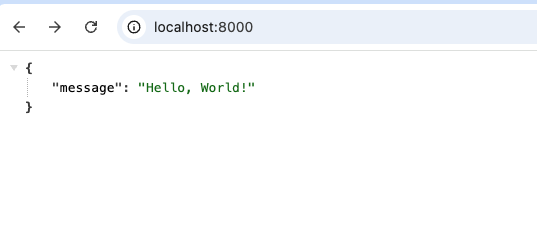

El servidor Uvicorn se ejecuta en el puerto 8000 por defecto. Si se desea usar otro puerto, se puede especificar con el parámetro `--port`. El siguiente comando ejecuta el servidor Uvicorn en el puerto 8000 con recarga automática.

```bash
uvicorn main:app --reload --port 8000
```

### Swagger y ReDoc

https://swagger.io/[Swagger] y https://redoc.ly/[ReDoc] son herramientas de documentación de APIs que permiten visualizar y probar las rutas de la API de forma interactiva. FastAPI genera automáticamente documentación interactiva para las APIs en formato Swagger y ReDoc. La documentación se genera automáticamente a partir de las anotaciones de tipo y los esquemas definidos en el código. Los esquemas de datos se utilizan para validar las entradas y salidas de las rutas de la API y los definiremos utilizando https://pydantic-docs.helpmanual.io/[Pydantic]. Pydantic es una biblioteca de validación de datos y serialización de objetos que se integra perfectamente con FastAPI.

La documentación Swagger generada está disponible en la ruta `/docs` de la aplicación FastAPI. La figura siguiente muestra la página de documentación de Swagger.

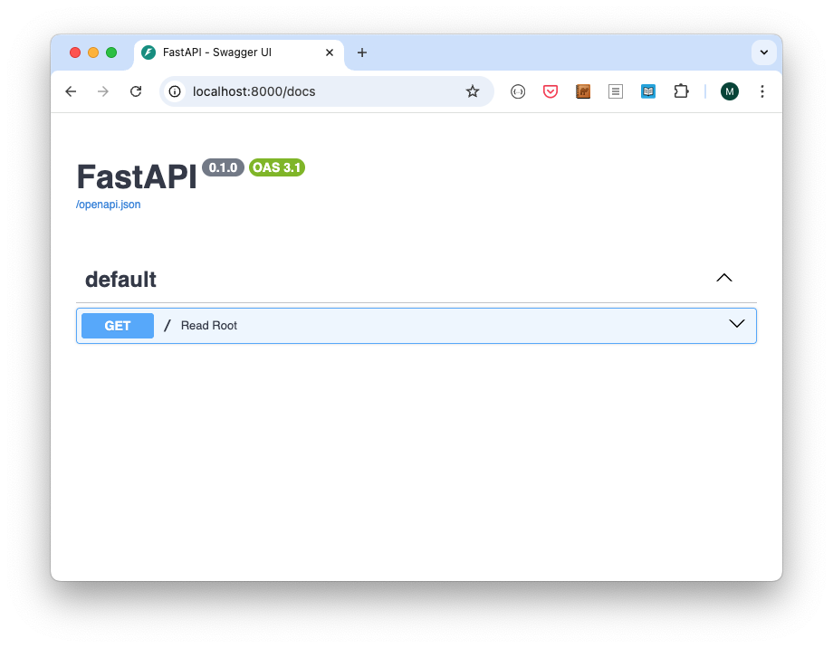

Es posible cambiar el título y la descripción de la documentación de Swagger utilizando los parámetros `title` y `description` al crear la aplicación FastAPI. Por ejemplo, se pueden hacer los siguientes cambios en el archivo `main.py`:

```python
app = FastAPI(
    title="Products and Reviews API",
    description="API for managing products and reviews using FastAPI and MySQL",
    version="1.0.0"
)
```

Después de este cambio, la documentación de Swagger mostrará el título y la descripción personalizados, como ilustra la figura siguiente.

[image:swagger-ui-custom.png[Swagger UI personalizado]]

Por otro lado, ReDoc es otra herramienta de documentación que presenta las rutas de la API de manera más estructurada y profesional. Está disponible en la ruta `/redoc`. La figura siguiente muestra la página de documentación de ReDoc.

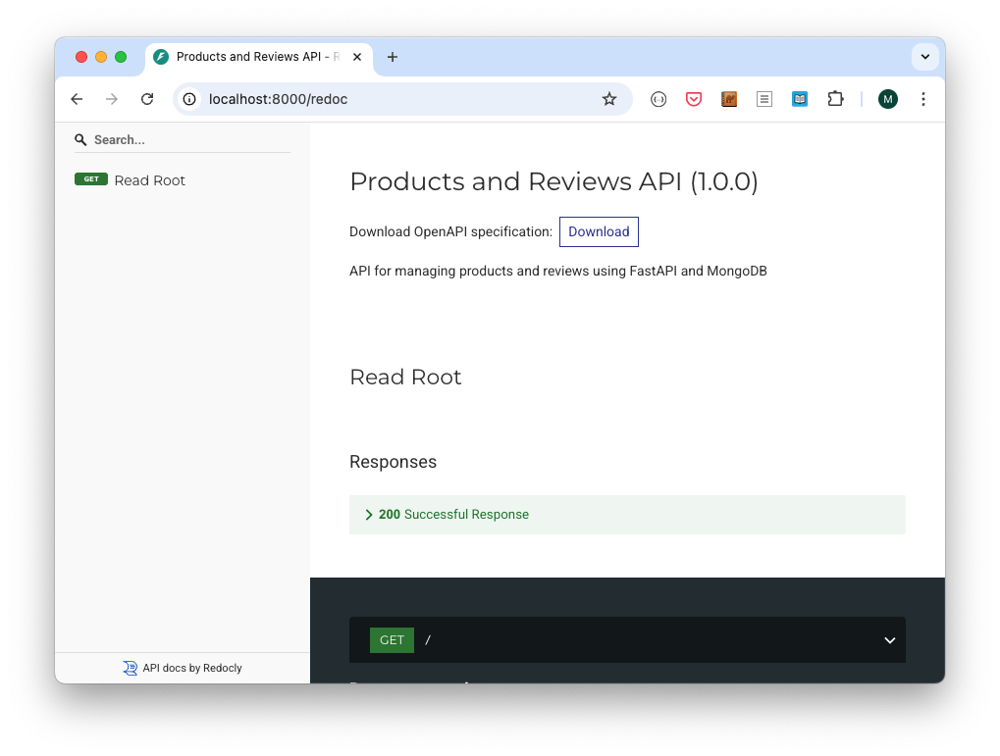

Ambas herramientas son generadas automáticamente por FastAPI a partir de las anotaciones de tipo y los esquemas definidos en el código. Esto elimina la necesidad de escribir documentación manualmente y asegura que siempre esté sincronizada con la implementación de la API.

### Organización del código

Para mantener el código organizado y facilitar el desarrollo, se recomienda dividir la aplicación en módulos y archivos separados. En FastAPI, se pueden definir las rutas y la lógica de negocio en módulos separados, y luego importarlos en el archivo principal de la aplicación. Esto facilita la gestión de rutas y la escalabilidad de la aplicación. A continuación se muestra una propuesta de organización de código en FastAPI.

```
FastAPIMySQLAPIProductosValoraciones/
│
├── __init__.py         # Archivo de inicialización. Puede estar vacío. Permite que Python trate el directorio como un paquete.
├── .env                # Archivo de variables de entorno
├── main.py             # Archivo principal de la aplicación
├── requirements.txt    # Archivo de dependencias
├── database.py         # Configuración de la base de datos
├── models.py           # Definición de modelos Pydantic
├── start.sh            # Script de inicio
├── create_data.sh      # Script opcional para crear datos de prueba
├── routes/             # Directorio de rutas
│   ├── users.py        # Rutas para usuarios
│   ├── products.py     # Rutas para productos
│   ├── categories.py   # Rutas para categorías
│   ├── reviews.py      # Rutas para valoraciones
│   ├── test.py         # Rutas de prueba
```

### Primeros archivos

A continuación se muestra el contenidos de los primeros archivos con los que arrancaremos la API. Eliminaremos la ruta (`/`) que hemos creado anteriormente a modo de prueba y añadiremos una nueva ruta de prueba (`/test`), pero ya en un archivo separado y en la carpeta `routes`.

**Archivo `.env`**

```python
MYSQL_USER=example
MYSQL_PASSWORD=example
MYSQL_HOST=mysql
MYSQL_DATABASE=mydatabase
```

[NOTE]
====
En este caso el valor de `mysql` se refiere al nombre del servicio MySQL definido en el archivo `docker-compose.yml`. Este es el mismo nombre que se utiliza en el archivo `docker-compose.yml`. Si se cuenta con un servidor MySQL en una URL específica, se puede cambiar el valor de `MYSQL_HOST` por la URL del servidor.
====

**Archivo `database.py`**

```python
from sqlalchemy import create_engine
from sqlalchemy.ext.declarative import declarative_base
from sqlalchemy.orm import sessionmaker
import os
from dotenv import load_dotenv

load_dotenv()

username = os.environ.get('MYSQL_USER')
password = os.environ.get('MYSQL_PASSWORD')
host = os.environ.get('MYSQL_HOST')
database = os.environ.get('MYSQL_DATABASE', 'mydatabase')

uri = f"mysql+mysqlconnector://{username}:{password}@{host}:3306/{database}"

engine = create_engine(uri)
SessionLocal = sessionmaker(autocommit=False, autoflush=False, bind=engine)
Base = declarative_base()

# Función para obtener sesión de DB
def get_db():
    db = SessionLocal()
    try:
        yield db
    finally:
        db.close()
```

[NOTE]
====
La conexión a MySQL se hace a través del método `create_engine` de la biblioteca `sqlalchemy`. Se utilizan las variables de entorno definidas en el archivo `.env` para la configuración de la conexión. Una vez establecida la conexión, se crea una sesión para interactuar con la base de datos y se define la base declarativa para los modelos.
====

**Archivo `models.py`**

Definimos aquí las clases Pydantic que representan los modelos de datos de la aplicación. Estos modelos se utilizan para validar los datos de entrada y salida de las rutas de la API. Por ejemplo, el modelo `Product` se utiliza para validar los datos de un producto y el modelo `ProductResponse` se utiliza para devolver los datos de un producto con su ID. Para definir las clases usaremos la especificación de los JSON que se ha hecho en la sección <<Especificación de los endpoints de la API>>.

Definiremos también clases de respuesta para los modelos de datos, que incluyen el ID generado por la base de datos y otros campos adicionales como las fechas de creación y actualización.

```python
from pydantic import BaseModel
from typing import Optional, List

class UserRequest(BaseModel):
    username: str
    email: str

class UserResponse(UserRequest):
    id: int
    created_at: str

class Product(BaseModel):
    name: str
    description: str
    price: float
    categoryId: str

class ProductResponse(Product):
    id: str

class Category(BaseModel):
    name: str
    description: str
    parentId: Optional[str] = None

class CategoryResponse(Category):
    id: str

class Review(BaseModel):
    productId: str
    userId: str
    username: str
    rating: float
    comment: str

class ReviewResponse(Review):
    id: str
    createdAt: str
    updatedAt: Optional[str] = None
````

**Archivo `routes/test.py`**

```python
from fastapi import APIRouter

router = APIRouter()

# Define a test API endpoint
@router.get("/")
async def test_api():
    return {"message": "API is working"}
```

[NOTE]
====
En este archivo definimos un endpoint de prueba `GET /api/test` que devuelve un mensaje de prueba. Este endpoint se utilizará para comprobar que la API está funcionando correctamente. El código del endpoint se define en una función asíncrona que devuelve un diccionario con el mensaje "API is working".
====

**Archivo `main.py`**

```python
from fastapi import FastAPI
from routes import test

app = FastAPI()

app.include_router(test.router, prefix="/api/test", tags=["test"])
```

[NOTE]
====
En este archivo creamos la aplicación FastAPI y añadimos el router de prueba que definimos anteriormente. El router se incluye en la aplicación con el prefijo `/api/test` y se le asigna la etiqueta `test`. Esto significa que el endpoint de prueba estará disponible en la ruta `/api/test` y se mostrará en la documentación de la API con la etiqueta `test`.
====


Tras esto, la API REST debería estar funcionando correctamente. Se puede probar accediendo a la URL `http://localhost:8000/api/test` en un navegador o utilizando una herramienta como Postman. También se puede probar la documentación de la API en `http://localhost:8000/docs` o `http://localhost:8000/redoc`. La respuesta debería ser un mensaje JSON con el texto "API is working". La figura siguiente ilustra la llamada al endpoint de prueba desde Swagger.

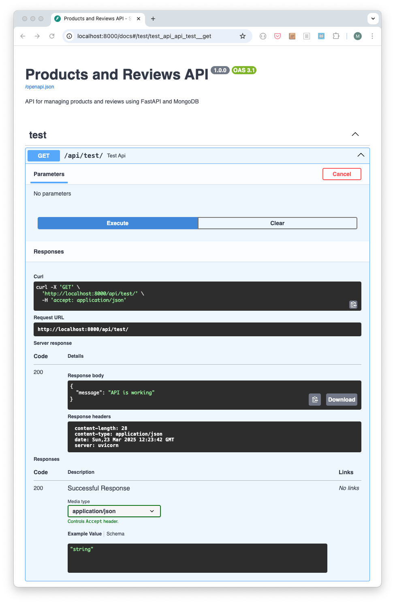

### Endpoints de usuarios

[NOTE]
====
Aunque el resto de endpoints se van a desarrollar con SQLAlchemy para interactuar con MySQL, el endpoint de usuarios se va a implementar utilizando consultas SQL directas para mostrar un ejemplo de cómo interactuar con MySQL sin usar un ORM. Esto puede ser útil en situaciones en las que nos queremos introducir en el desarrollo de la API REST paulatinamente aprovechando conocimientos previos de SQL, cuando se requiere un mayor control sobre las consultas SQL o cuando se quiere evitar la sobrecarga de un ORM en aplicaciones simples.
====

En el archivo `routes/users.py` añade el siguiente código antes de la definición de las rutas de usuarios:

[source,python]
----
from fastapi import APIRouter, HTTPException, Depends
from sqlalchemy import text
from sqlalchemy.orm import Session
from typing import List
from models import UserRequest, UserResponse
from database import get_db

router = APIRouter()

// Los endpoints de usuarios se definen aquí
----

#### Añadir el enrutado de usuarios a `main.py`

Modificar el archivo `main.py` para incluir el enrutado de usuarios en la aplicación FastAPI. Se harán modificaciones para importar el router de usuarios y añadirlo a la aplicación con el prefijo `/api/users` y la etiqueta `users`.

[source,python]
----
from fastapi import FastAPI
from routes import test, users # Importar el router de usuarios
from database import engine
from sqlalchemy import text

# Crear tabla users si no existe
with engine.connect() as conn:
    conn.execute(text("""
        CREATE TABLE IF NOT EXISTS users (
            id INT AUTO_INCREMENT PRIMARY KEY,
            username VARCHAR(255) NOT NULL UNIQUE,
            email VARCHAR(255) NOT NULL UNIQUE,
            created_at DATETIME DEFAULT CURRENT_TIMESTAMP
        )
    """))
    conn.commit()

app.include_router(test.router, prefix="/api/test", tags=["test"])
app.include_router(users.router, prefix="/api/users", tags=["users"])   # Añadir el router de usuarios
----

#### Endpoint para crear un usuario

Añade el siguiente código para definir un endpoint `POST /api/users` que permite crear un nuevo usuario. Este endpoint recibe los datos del usuario en formato JSON en el cuerpo de la solicitud y los inserta en la tabla de usuarios de MySQL. En el cuerpo de la solicitud se deben proporcionar los siguientes campos: `username` y `email`. El endpoint devuelve los datos del usuario creado, incluyendo su ID generado por la base de datos. La operación SQL que se usaría para insertar un registro en la tabla de usuarios sería similar a la siguiente:

```
INSERT INTO users (username, email) VALUES ('usuario123', 'usuario123@example.com');
```

[source,python]
----
# Route to create a new user
@router.post("/", response_model=UserResponse, status_code=201)
async def create_user(user: UserRequest, db: Session = Depends(get_db)):
    try:
        result = db.execute(text("INSERT INTO users (username, email) VALUES (:username, :email)"), {"username": user.username, "email": user.email})
        db.commit()
        user_id = result.lastrowid
        result_select = db.execute(text("SELECT id, username, email, created_at FROM users WHERE id = :id"), {"id": user_id})
        row = result_select.fetchone()
        return UserResponse(id=row[0], username=row[1], email=row[2], created_at=row[3].strftime("%Y-%m-%dT%H:%M:%SZ"))
    except Exception as e:
        db.rollback()
        raise HTTPException(status_code=400, detail=str(e))
----

#### Endpoint para obtener todos los usuarios

Añade el siguiente código para definir un endpoint `GET /api/users` que permite obtener todos los usuarios. Este endpoint consulta todos los registros de la tabla de usuarios de MySQL y los devuelve en formato JSON. La operación SQL que se usaría para consultar todos los registros en la tabla de usuarios sería similar a la siguiente:

```
SELECT id, username, email, created_at FROM users;
```

[source,python]
----
# Route to get all users
@router.get("/", response_model=List[UserResponse])
async def get_users(db: Session = Depends(get_db)):
    result = db.execute(text("SELECT id, username, email, created_at FROM users"))
    users = []
    for row in result:
        users.append(UserResponse(id=row[0], username=row[1], email=row[2], created_at=row[3].strftime("%Y-%m-%dT%H:%M:%SZ")))
    return users
----

#### Endpoint para obtener un usuario por ID

Añade el siguiente código para definir un endpoint `GET /api/users/{id}` que permite obtener un usuario por su ID. Este endpoint consulta el registro de la tabla de usuarios de MySQL correspondiente al ID proporcionado en la URL y lo devuelve en formato JSON. Si el usuario existe, se devuelve su información en formato JSON. Si el usuario no existe, se devuelve un mensaje de error. La operación SQL que se usaría para consultar un registro en la tabla de usuarios por su ID sería similar a la siguiente:

```
SELECT id, username, email, created_at FROM users WHERE id = 1;
```

[source,python]
----
# Route to get a user by ID
@router.get("/{id}", response_model=UserResponse)
async def get_user(id: int, db: Session = Depends(get_db)):
    result = db.execute(text("SELECT id, username, email, created_at FROM users WHERE id = :id"), {"id": id})
    row = result.fetchone()
    if not row:
        raise HTTPException(status_code=404, detail="User not found")
    return UserResponse(id=row[0], username=row[1], email=row[2], created_at=row[3].strftime("%Y-%m-%dT%H:%M:%SZ"))
----

#### Endpoint para actualizar un usuario

Añade el siguiente código para definir un endpoint `PUT /api/users/{id}` que permite actualizar un usuario por su ID. Este endpoint recibe el ID del usuario como parámetro en la URL y los nuevos datos del usuario en formato JSON en el cuerpo de la solicitud. Los datos del usuario a actualizar deben incluir los campos: `username` y `email`. El endpoint busca el usuario por su ID. El endpoint actualiza el usuario correspondiente en la tabla de usuarios de MySQL. Si el usuario se actualiza correctamente, se devuelve un mensaje de éxito. Si el usuario no existe, se devuelve un mensaje de error. La operación SQL que se usaría para actualizar un usuario en la tabla de usuarios sería similar a la siguiente:

```
UPDATE users SET username = 'nuevo_usuario', email = 'nuevo_email@example.com' WHERE id = 1;
```

[source,python]
----
# Route to update a user by ID
@router.put("/{id}", response_model=UserResponse)
async def update_user(id: int, user: UserRequest, db: Session = Depends(get_db)):
    try:
        db.execute(text("UPDATE users SET username = :username, email = :email WHERE id = :id"), {"username": user.username, "email": user.email, "id": id})
        db.commit()
        result = db.execute(text("SELECT id, username, email, created_at FROM users WHERE id = :id"), {"id": id})
        row = result.fetchone()
        if not row:
            raise HTTPException(status_code=404, detail="User not found")
        return UserResponse(id=row[0], username=row[1], email=row[2], created_at=row[3].strftime("%Y-%m-%dT%H:%M:%SZ"))
    except Exception as e:
        db.rollback()
        raise HTTPException(status_code=400, detail=str(e))
----

#### Endpoint para eliminar un usuario

Añade el siguiente código para definir un endpoint `DELETE /api/users/{id}` que permite eliminar un usuario por su ID. Este endpoint recibe el ID del usuario como parámetro en la URL. El endpoint busca el usuario por su ID y lo elimina de la tabla de usuarios de MySQL. Si el usuario se elimina correctamente, se devuelve un mensaje de éxito. Si el usuario no existe, se devuelve un mensaje de error. La operación SQL que se usaría para eliminar un usuario en la tabla de usuarios sería similar a la siguiente:

```
DELETE FROM users WHERE id = 1;
```

[source,python]
----
# Route to delete a user by ID
@router.delete("/{id}")
async def delete_user(id: int, db: Session = Depends(get_db)):
    try:
        result = db.execute(text("DELETE FROM users WHERE id = :id"), {"id": id})
        if result.rowcount == 0:
            raise HTTPException(status_code=404, detail="User not found")
        db.commit()
        return {"message": "User deleted"}
    except Exception as e:
        db.rollback()
        raise HTTPException(status_code=400, detail=str(e))
----

### Endpoints de categorías

En esta sección vamos a implementar los endpoints para gestionar categorías en la API REST. Los endpoints incluyen la creación, consulta, actualización y eliminación de categorías.

[NOTE]
====
De aquí en adelante, los endpoints se implementarán utilizando SQLAlchemy para interactuar con MySQL. SQLAlchemy es un ORM (Object-Relational Mapping) que facilita la interacción con bases de datos relacionales mediante el uso de objetos y clases en lugar de escribir consultas SQL directamente. Esto permite una mayor abstracción y facilita el desarrollo de la API REST. Con SQLAlchemy, se pueden definir modelos de datos como clases de Python y utilizar métodos y funciones (como `add`, `query`, `filter`, `update`, `delete`, etc.) para realizar operaciones CRUD (Crear, Leer, Actualizar, Eliminar) en la base de datos.
====

En el archivo `routes/categories.py` añade el siguiente código antes de la definición de las rutas de categorías:

[source,python]
----
from fastapi import APIRouter, HTTPException, Depends
from sqlalchemy.orm import Session
from typing import List
from models import Category, CategoryResponse, CategoryDB
from database import get_db

router = APIRouter()

// Los endpoints de categorías se definen aquí
----

#### Añadir el enrutado de categorías a `main.py`

Modificar el archivo `main.py` para incluir el enrutado de categorías en la aplicación FastAPI. Se harán modificaciones para importar el router de categorías y añadirlo a la aplicación con el prefijo `/api/categories` y la etiqueta `categories`.
[source,python]
----
from fastapi import FastAPI
from routes import test, users, categories # Importar el router de categorías
from database import engine, Base
from sqlalchemy import text

# Crear tablas si no existen. Al usar SQLAlchemy, se crean todas las tablas definidas en los modelos que heredan de Base
Base.metadata.create_all(bind=engine)

# Crear tabla users si no existe
with engine.connect() as conn:
    conn.execute(text("""
        CREATE TABLE IF NOT EXISTS users (
            id INT AUTO_INCREMENT PRIMARY KEY,
            username VARCHAR(255) NOT NULL UNIQUE,
            email VARCHAR(255) NOT NULL UNIQUE,
            created_at DATETIME DEFAULT CURRENT_TIMESTAMP
        )
    """))
    conn.commit()

app = FastAPI(
    title="Products and Reviews API",
    description="API for managing products and reviews using FastAPI and MySQL",
    version="1.0.0"
)

app.include_router(test.router, prefix="/api/test", tags=["test"])
app.include_router(users.router, prefix="/api/users", tags=["users"])
app.include_router(categories.router, prefix="/api/categories", tags=["categories"])
----

#### Endpoint para crear una categoría

Añade el siguiente código para definir un endpoint `POST /api/categories` que permite crear una nueva categoría. Este endpoint recibe los datos de la categoría en formato JSON en el cuerpo de la solicitud y los inserta en la tabla de categorías de MySQL. En el cuerpo de la solicitud se deben proporcionar los siguientes campos: `name`, `description` y `parentId`. El endpoint devuelve un mensaje con el ID de la nueva categoría creada. 

[NOTE]
====
Como usamos SQLAlchemy, no es necesario escribir la consulta SQL directamente. En su lugar, se crea una instancia del modelo `CategoryDB` con los datos proporcionados y se añade a la sesión de la base de datos. Luego, se confirma la transacción para guardar los cambios en la base de datos.
====

[source,python]
----
# Route to create a new category
@router.post("/", response_model=CategoryResponse, status_code=201)
async def create_category(category: Category, db: Session = Depends(get_db)):
    category_db = CategoryDB(**category.dict())
    db.add(category_db)
    db.commit()
    db.refresh(category_db)
    return CategoryResponse(id=category_db.id, **category.dict())
----

#### Endpoint para obtener todas las categorías

Añade el siguiente código para definir un endpoint `GET /api/categories` que permite obtener todas las categorías. Este endpoint consulta todas las categorías de la tabla de categorías de MySQL y las devuelve en formato JSON. 

[NOTE]
====
Como usamos SQLAlchemy, no es necesario escribir la consulta SQL directamente. En su lugar, se consulta la tabla de categorías usando el ORM y se devuelve la lista de categorías.
====

[source,python]
----
# Route to get all categories
@router.get("/", response_model=List[CategoryResponse])
async def get_categories(db: Session = Depends(get_db)):
    categories = db.query(CategoryDB).all()
    return [CategoryResponse(id=c.id, name=c.name, description=c.description, parentId=c.parentId) for c in categories]
----

#### Endpoint para obtener una categoría por ID

Añade el siguiente código para definir un endpoint `GET /api/categories/{id}` que permite obtener una categoría por su ID. Este endpoint recibe el ID de la categoría como parámetro en la URL y busca la categoría correspondiente en la tabla de categorías de MySQL. Si la categoría existe, se devuelve su información en formato JSON. Si la categoría no existe, se devuelve un mensaje de error. 

[NOTE]
====
Como usamos SQLAlchemy, no es necesario escribir la consulta SQL directamente. En su lugar, se consulta la tabla de categorías usando el ORM y se devuelve la categoría.
====

[source,python]
----
# Route to get a category by ID
@router.put("/{id}", response_model=CategoryResponse)
async def update_category(id: int, category: Category, db: Session = Depends(get_db)):
    category_db = db.query(CategoryDB).filter(CategoryDB.id == id).first()
    if not category_db:
        raise HTTPException(status_code=404, detail="Category not found")
    for key, value in category.dict().items():
        setattr(category_db, key, value)
    db.commit()
    db.refresh(category_db)
    return CategoryResponse(id=category_db.id, **category.dict())
----

#### Endpoint para actualizar una categoría

Añade el siguiente código para definir un endpoint `PUT /api/categories/{id}` que permite actualizar una categoría por su ID. Este endpoint recibe el ID de la categoría como parámetro en la URL y los nuevos datos de la categoría en formato JSON en el cuerpo de la solicitud. Los datos de la categoría a actualizar deben incluir los campos `name`, `description` y `parentId`. El endpoint actualiza la categoría correspondiente en la tabla de categorías de MySQL. Si la categoría se actualiza correctamente, se devuelve un mensaje de éxito. Si la categoría no se encuentra, se devuelve un mensaje de error. 

[NOTE]
====
Como usamos SQLAlchemy, no es necesario escribir la consulta SQL directamente. En su lugar, se consulta la tabla de categorías usando el ORM, se actualizan los campos y se confirma la transacción para guardar los cambios en la base de datos.
====

[source,python]
----
# Route to update a category by ID
@router.put("/{id}", response_model=CategoryResponse)
async def update_category(id: str, category: Category):
    try:
        result = categories_collection.update_one(
            {"_id": ObjectId(id)},
            {"$set": category.dict()}
        )
        if result.matched_count == 0:
            raise HTTPException(status_code=404, detail="Category not found")
        updated_category = categories_collection.find_one({"_id": ObjectId(id)})
        updated_category["id"] = str(updated_category["_id"])
        del updated_category["_id"]
        return updated_category
    except Exception:
        raise HTTPException(status_code=400, detail="Invalid category ID")
----

#### Endpoint para eliminar una categoría

Añade el siguiente código para definir un endpoint `DELETE /api/categories/{id}` que permite eliminar una categoría por su ID. Este endpoint recibe el ID de la categoría como parámetro en la URL y elimina la categoría correspondiente de la tabla de categorías de MySQL. Si la categoría se elimina correctamente, se devuelve un mensaje de éxito. Si la categoría no se encuentra, se devuelve un mensaje de error. 

[NOTE]
====
Como usamos SQLAlchemy, no es necesario escribir la consulta SQL directamente. En su lugar, se consulta la tabla de categorías usando el ORM y se elimina la categoría.
====

[source,python]
----
# Route to delete a category by ID
@router.delete("/{id}", status_code=200)
async def delete_category(id: int, db: Session = Depends(get_db)):
    category = db.query(CategoryDB).filter(CategoryDB.id == id).first()
    if not category:
        raise HTTPException(status_code=404, detail="Category not found")
    db.delete(category)
    db.commit()
    return {"message": "Category deleted"}
----

### Endpoints de productos

En esta sección vamos a implementar los endpoints para gestionar productos en la API REST. Los endpoints incluyen la creación, consulta, actualización y eliminación de productos.

En el archivo `routes/products.py` añade el siguiente código antes de la definición de las rutas de productos:

[source,python]
----
from fastapi import APIRouter, HTTPException, Depends
from sqlalchemy.orm import Session
from typing import Optional, List
from models import Product, ProductResponse, ProductDB
from database import get_db

router = APIRouter()

// Los endpoints de productos se definen aquí
----

#### Añadir el enrutado de productos a `main.py`

Modificar el archivo `main.py` para incluir el enrutado de productos en la aplicación FastAPI. Se harán modificaciones para importar el router de productos y añadirlo a la aplicación con el prefijo `/api/products` y la etiqueta `products`.

[source,python]
----
from fastapi import FastAPI
from routes import test, users, categories, products # Importar el router de productos
from database import engine, Base
from sqlalchemy import text

# Crear tablas si no existen. Al usar SQLAlchemy, se crean todas las tablas definidas en los modelos que heredan de Base
Base.metadata.create_all(bind=engine)

# Crear tabla users si no existe
with engine.connect() as conn:
    conn.execute(text("""
        CREATE TABLE IF NOT EXISTS users (
            id INT AUTO_INCREMENT PRIMARY KEY,
            username VARCHAR(255) NOT NULL UNIQUE,
            email VARCHAR(255) NOT NULL UNIQUE,
            created_at DATETIME DEFAULT CURRENT_TIMESTAMP
        )
    """))
    conn.commit()

app = FastAPI(
    title="Products and Reviews API",
    description="API for managing products and reviews using FastAPI and MySQL",
    version="1.0.0"
)

app.include_router(test.router, prefix="/api/test", tags=["test"])
app.include_router(users.router, prefix="/api/users", tags=["users"])
app.include_router(categories.router, prefix="/api/categories", tags=["categories"])
app.include_router(products.router, prefix="/api/products", tags=["products"])  # Añadir el router de productos
----

#### Endpoint para crear un producto

Añade el siguiente código para definir un endpoint `POST /api/products` que permite crear un nuevo producto. Este endpoint recibe los datos del producto en formato JSON en el cuerpo de la solicitud y los inserta en la tabla de productos de MySQL. En el cuerpo de la solicitudo se deben proporcionar los siguientes campos: `name`, `description`, `price` y `categoryId`. El endpoint devuelve un mensaje con el ID del nuevo producto creado. 

[NOTE]
====
Como usamos SQLAlchemy, no es necesario escribir la consulta SQL directamente. En su lugar, se crea una instancia del modelo `ProductDB` con los datos proporcionados y se añade a la sesión de la base de datos. Luego, se confirma la transacción para guardar los cambios en la base de datos.
====

[source,python]
----
# Route to create a new product
@router.post("/", response_model=ProductResponse, status_code=201)
async def create_product(product: Product, db: Session = Depends(get_db)):
    product_db = ProductDB(**product.dict())
    db.add(product_db)
    db.commit()
    db.refresh(product_db)
    return ProductResponse(**product.dict(), id=product_db.id)
----

#### Endpoint para obtener detalles de un producto

Añade el siguiente código para definir un endpoint `GET /api/products/{id}` que permite obtener los detalles de un producto por su ID. Este endpoint recibe el ID del producto como parámetro en la URL y busca el producto correspondiente en la tabla de productos de MySQL. Si el producto existe, se devuelve su información en formato JSON. Si el producto no existe, se devuelve un mensaje de error. 

[NOTE]
====
Como usamos SQLAlchemy, no es necesario escribir la consulta SQL directamente. En su lugar, se consulta la tabla de productos usando el ORM y se devuelve el producto.
====

[source,python]
----
# Route to get a product by ID
@router.get("/{id}", response_model=ProductResponse)
async def get_product(id: int, db: Session = Depends(get_db)):
    product = db.query(ProductDB).filter(ProductDB.id == id).first()
    if not product:
        raise HTTPException(status_code=404, detail="Product not found")
    return ProductResponse(id=product.id, name=product.name, description=product.description, price=product.price, categoryId=product.categoryId)
----

#### Endpoint para consultar productos

Añade el siguiente código para definir un endpoint `GET /api/products` que permite consultar productos. Este endpoint admite parámetros de consulta opcionales para filtrar los productos por categoría (`categoryId`) o por nombre (`name`). Si se proporciona el parámetro `categoryId`, se filtran los productos por la categoría especificada. Si se proporciona el parámetro `name`, se filtran los productos por el nombre que coincida con la cadena especificada. Se pueden combinar ambos parámetros para realizar búsquedas más específicas. Esta operación devuelve una lista de productos en formato JSON. 

[NOTE]
====
Como usamos SQLAlchemy, no es necesario escribir la consulta SQL directamente. En su lugar, se consulta la tabla de productos usando el ORM y se devuelve la lista de productos.
====

[source,python]
----
# Route to get all products
@router.get("/", response_model=List[ProductResponse])
async def get_products(categoryId: Optional[str] = None, name: Optional[str] = None, db: Session = Depends(get_db)):
    query = db.query(ProductDB)
    if categoryId:
        query = query.filter(ProductDB.categoryId == categoryId)
    if name:
        query = query.filter(ProductDB.name.ilike(f"%{name}%"))
    products = query.all()
    return [ProductResponse(id=p.id, name=p.name, description=p.description, price=p.price, categoryId=p.categoryId) for p in products]
----

#### Endpoint para actualizar un producto

Añade el siguiente código para definir un endpoint `PUT /api/products/{id}` que permite actualizar un producto por su ID. Este endpoint recibe el ID del producto como parámetro en la URL y los nuevos datos del producto en formato JSON en el cuerpo de la solicitud. Los datos del producto a actualizar deben incluir los campos `name`, `description`, `price` y `categoryId`. El endpoint actualiza el producto correspondiente en la tabla de productos de MySQL. Si el producto se actualiza correctamente, se devuelve un mensaje de éxito. Si el producto no se encuentra, se devuelve un mensaje de error.

[NOTE]
====
Como usamos SQLAlchemy, no es necesario escribir la consulta SQL directamente. En su lugar, se consulta la tabla de productos usando el ORM, se actualizan los campos y se confirma la transacción para guardar los cambios en la base de datos.
====

[source,python]
----
# Route to update a product by ID
@router.put("/{id}", response_model=ProductResponse)
async def update_product(id: int, product: Product, db: Session = Depends(get_db)):
    product_db = db.query(ProductDB).filter(ProductDB.id == id).first()
    if not product_db:
        raise HTTPException(status_code=404, detail="Product not found")
    for key, value in product.dict().items():
        setattr(product_db, key, value)
    db.commit()
    db.refresh(product_db)
    return ProductResponse(id=product_db.id, **product.dict())
----

#### Endpoint para eliminar un producto

Añade el siguiente código para definir un endpoint `DELETE /api/products/{id}` que permite eliminar un producto por su ID. Este endpoint recibe el ID del producto como parámetro en la URL y elimina el producto correspondiente de la tabla de productos de MySQL. También elimina los comentarios asociados al producto. Si el producto se elimina correctamente, se devuelve un mensaje de éxito. Si el producto no se encuentra, se devuelve un mensaje de error.

[NOTE]
====
Como usamos SQLAlchemy, no es necesario escribir la consulta SQL directamente. En su lugar, se consulta la tabla de productos usando el ORM y se elimina el producto. Luego, se eliminan los comentarios asociados al producto.
====

[source,python]
----
# Route to delete a product by ID
@router.delete("/{id}", status_code=200)
async def delete_product(id: int, db: Session = Depends(get_db)):
    product = db.query(ProductDB).filter(ProductDB.id == id).first()
    if not product:
        raise HTTPException(status_code=404, detail="Product not found")
    db.delete(product)
    # Delete associated reviews (including their comments)
    from models import ReviewDB
    db.query(ReviewDB).filter(ReviewDB.productId == id).delete()
    db.commit()
    return {"message": "Product and associated reviews deleted"}
----

### Endpoints de comentarios

En esta sección, vamos a implementar los endpoints para gestionar comentarios en la API REST. Los endpoints incluyen la creación, consulta, actualización y eliminación de comentarios.

En el archivo `routes/reviews.py` añade el siguiente código antes de la definición de las rutas de comentarios:

[source,python]
----
from fastapi import APIRouter, HTTPException, Depends
from sqlalchemy.orm import Session
from typing import List, Optional
from datetime import datetime
from models import Review, ReviewResponse, ReviewDB
from database import get_db
import pytz

router = APIRouter()

// Los endpoints de comentarios se definen aquí
----

#### Añadir el enrutado de comentarios a `main.py`

Modificar el archivo `main.py` para incluir el enrutado de comentarios en la aplicación FastAPI. Se harán modificaciones para importar el router de comentarios y añadirlo a la aplicación con el prefijo `/api/reviews` y la etiqueta `reviews`.

[source,python]
----
from fastapi import FastAPI
from routes import test, users, categories, products, reviews   # Importar el router de comentarios
from database import engine, Base
from sqlalchemy import text

# Crear tablas si no existen. Al usar SQLAlchemy, se crean todas las tablas definidas en los modelos que heredan de Base
Base.metadata.create_all(bind=engine)

# Crear tabla users si no existe
with engine.connect() as conn:
    conn.execute(text("""
        CREATE TABLE IF NOT EXISTS users (
            id INT AUTO_INCREMENT PRIMARY KEY,
            username VARCHAR(255) NOT NULL UNIQUE,
            email VARCHAR(255) NOT NULL UNIQUE,
            created_at DATETIME DEFAULT CURRENT_TIMESTAMP
        )
    """))
    conn.commit()

app = FastAPI(
    title="Products and Reviews API",
    description="API for managing products and reviews using FastAPI and MySQL",
    version="1.0.0"
)

app.include_router(test.router, prefix="/api/test", tags=["test"])
app.include_router(users.router, prefix="/api/users", tags=["users"])
app.include_router(categories.router, prefix="/api/categories", tags=["categories"])
app.include_router(products.router, prefix="/api/products", tags=["products"])
app.include_router(reviews.router, prefix="/api/reviews", tags=["reviews"])  # Añadir el router de comentarios
----

#### Endpoint para añadir un comentario a un producto

Añade el siguiente código para definir un endpoint `POST /api/reviews` que permite añadir un comentario a un producto. Este endpoint recibe los datos del comentario en formato JSON en el cuerpo de la solicitud y los inserta en la tabla de comentarios de MySQL. En el cuerpo de la solicitud se deben proporcionar los siguientes campos: `productId`, `userId`, `username`, `rating` y `comment`. El endpoint devuelve un mensaje con el ID del nuevo comentario creado.

[NOTE]
====
Como usamos SQLAlchemy, no es necesario escribir la consulta SQL directamente. En su lugar, se crea una instancia del modelo `ReviewDB` con los datos proporcionados y se añade a la sesión de la base de datos. Luego, se confirma la transacción para guardar los cambios en la base de datos.
====

[source,python]
----
# Route to create a new review
@router.post("/", response_model=ReviewResponse, status_code=201)
async def create_review(review: Review, db: Session = Depends(get_db)):
    review_db = ReviewDB(**review.dict(), createdAt=datetime.now(pytz.UTC))
    db.add(review_db)
    db.commit()
    db.refresh(review_db)
    return ReviewResponse(id=review_db.id, createdAt=review_db.createdAt.strftime("%Y-%m-%dT%H:%M:%SZ"), **review.dict())
----

#### Endpoint para obtener los comentarios de un producto o por usuario

Añade el siguiente código para definir un endpoint `GET /api/reviews` que permite obtener los comentarios de un producto o por usuario. Este endpoint admite parámetros de consulta opcionales para filtrar los comentarios por producto (`productId`) o por usuario (`userId`). Si se proporciona el parámetro `productId`, se filtran los comentarios por el producto especificado. Si se proporciona el parámetro `userId`, se filtran los comentarios por el usuario especificado. Se pueden combinar ambos parámetros para realizar búsquedas más específicas. Esta operación devuelve una lista de comentarios en formato JSON.

[NOTE]
====
Como usamos SQLAlchemy, no es necesario escribir la consulta SQL directamente. En su lugar, se consulta la tabla de comentarios usando el ORM y se devuelve la lista de comentarios.
====

[source,python]
----
# Route to get all reviews or filter by productId or userId
@router.get("/", response_model=List[ReviewResponse])
async def get_reviews(productId: Optional[int] = None, userId: Optional[str] = None, db: Session = Depends(get_db)):
    query = db.query(ReviewDB)
    if productId:
        query = query.filter(ReviewDB.productId == productId)
    if userId:
        query = query.filter(ReviewDB.userId == userId)
    reviews = query.all()
    return [ReviewResponse(id=r.id, productId=r.productId, userId=r.userId, username=r.username, rating=r.rating, comment=r.comment, createdAt=r.createdAt.strftime("%Y-%m-%dT%H:%M:%SZ"), updatedAt=r.updatedAt.strftime("%Y-%m-%dT%H:%M:%SZ") if r.updatedAt else None) for r in reviews]
----

#### Endpoint para actualizar un comentario

Añade el siguiente código para definir un endpoint `PUT /api/reviews/{id}` que permite actualizar un comentario por su ID. Este endpoint recibe el ID del comentario como parámetro en la URL y los nuevos datos del comentario en formato JSON en el cuerpo de la solicitud. Los datos del comentario a actualizar deben incluir los campos `userId`, `rating` y `comment`. El endpoint actualiza el comentario correspondiente en la tabla de comentarios de MySQL. Como medida de seguridad se verifica que el usuario que intenta actualizar el comentario sea el mismo que lo creó. Si el comentario se actualiza correctamente, se devuelve un mensaje de éxito. Si el comentario no se encuentra, se devuelve un mensaje de error.

[NOTE]
====
Como usamos SQLAlchemy, no es necesario escribir la consulta SQL directamente. En su lugar, se consulta la tabla de comentarios usando el ORM, se actualizan los campos y se confirma la transacción para guardar los cambios en la base de datos.
====

[source,python]
----
# Route to update a review by ID
@router.put("/{id}", response_model=ReviewResponse)
async def update_review(id: int, review: Review, db: Session = Depends(get_db)):
    review_db = db.query(ReviewDB).filter(ReviewDB.id == id, ReviewDB.userId == review.userId).first()
    if not review_db:
        raise HTTPException(status_code=403, detail="You can only update your own reviews")
    review_db.rating = review.rating
    review_db.comment = review.comment
    review_db.updatedAt = datetime.now(pytz.UTC)
    db.commit()
    db.refresh(review_db)
    return ReviewResponse(id=review_db.id, productId=review_db.productId, userId=review_db.userId, username=review_db.username, rating=review_db.rating, comment=review_db.comment, createdAt=review_db.createdAt.strftime("%Y-%m-%dT%H:%M:%SZ"), updatedAt=review_db.updatedAt.strftime("%Y-%m-%dT%H:%M:%SZ"))
----

#### Endpoint para eliminar un comentario

Añade el siguiente código para definir un endpoint `DELETE /api/reviews/{id}` que permite eliminar un comentario por su ID. Este endpoint recibe el ID del comentario como parámetro en la URL y elimina el comentario correspondiente de la tabla de comentarios de MySQL. Como medida de seguridad se verifica que el usuario que intenta eliminar el comentario sea el mismo que lo creó. Si el comentario se elimina correctamente, se devuelve un mensaje de éxito. Si el comentario no se encuentra, se devuelve un mensaje de error.

[source,python]
----
# Route to delete a review by ID
@router.delete("/{id}")
async def delete_review(id: int, request_body: dict, db: Session = Depends(get_db)):
    userId = request_body.get("userId")
    if not userId:
        raise HTTPException(status_code=400, detail="userId is required in request body")
    review = db.query(ReviewDB).filter(ReviewDB.id == id, ReviewDB.userId == userId).first()
    if not review:
        raise HTTPException(status_code=403, detail="You can only delete your own reviews")
    db.delete(review)
    db.commit()
    return {"message": "Review deleted"}
----

## Indices para mejorar el rendimiento

Los índices son cruciales para mejorar el rendimiento de las consultas en una base de datos. Sin índices, MySQL debe realizar un escaneo completo de las tablas para encontrar los registros que coinciden con la consulta, lo que puede ser muy ineficiente y lento, especialmente en tablas grandes. Los índices permiten a MySQL buscar de manera más eficiente, reduciendo el tiempo de respuesta de las consultas y mejorando el rendimiento general de la aplicación.

En el contexto de esta API, los índices pueden ayudar a acelerar las consultas que filtran productos por categoría, buscan productos por nombre, o filtran comentarios por producto o usuario. Al definir índices en los campos más consultados, se puede reducir significativamente el tiempo de respuesta de estos endpoints, proporcionando una mejor experiencia de usuario.

### Índices recomendados para la API

Definir los índices adecuados en MySQL es una práctica esencial para optimizar el rendimiento de las consultas y garantizar que la API funcione de manera eficiente, incluso con grandes volúmenes de datos. Para mejorar el rendimiento de los endpoints, es recomendable definir los siguientes índices en MySQL:

* **Indices para la tabla de productos**
    ** Indice en el campo `categoryId` para filtrar productos por categoría:
+
[source, bash]
----
CREATE INDEX idx_categoryId ON products (categoryId);
----
    ** Indice en el campo `name` para buscar productos por nombre:
+
[source, bash]
----
CREATE INDEX idx_name ON products (name);
----

* **Indices para la tabla de categorías**
    ** Indice en el campo `parentId` para construir la jerarquía de categorías:
+
[source, bash]
----
CREATE INDEX idx_parentId ON categories (parentId);
----

* **Indices para la tabla de comentarios**
    ** Indice en el campo `productId` para filtrar comentarios por producto:
+
[source, bash]
----
CREATE INDEX idx_productId ON reviews (productId);
----
    ** Indice en el campo `userId` para filtrar comentarios por usuario:
+
[source, bash]
----
CREATE INDEX idx_userId ON reviews (userId);x
----

## Pruebas de la API

Una vez que hemos desarrollado la API REST con FastAPI, podemos probar los endpoints utilizando Postman. A continuación se muestran algunos ejemplos de peticiones a la API REST:

* Crear una nueva categoría:
    - Método: `POST`
    - URL: `http://localhost:8000/api/categories`
    - Cuerpo: `{"name": "Electrónica", "description": "Categoría de productos electrónicos", "parentId": null}`
    - Respuesta esperada: `{
        "name": "Electrónica",
        "description": "Categoría de productos electrónicos",
        "parentId": null,
        "id": "67e1a445567da5eeb6d61a2d"
        }`
+
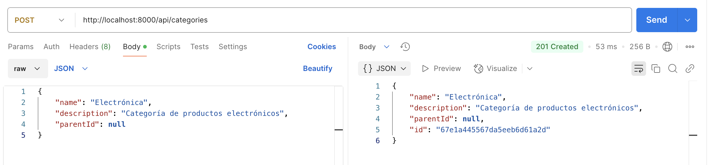
* Obtener todas las categorías:
    - Método: `GET`
    - URL: `http://localhost:8000/api/categories`
    - Respuesta esperada: Lista de categorías en formato JSON
+
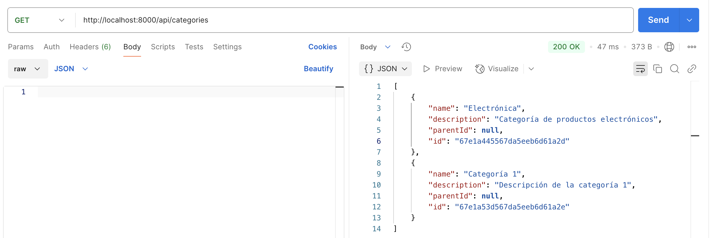
* Crear un nuevo producto:
    - Método: `POST`
    - URL: `http://localhost:8000/api/products`
    - Cuerpo: `{"name": "Smartphone", "description": "Teléfono inteligente", "price": 500, "categoryId": "67e1a445567da5eeb6d61a2d"}`
    - Respuesta esperada: `{
        "name": "Smartphone",
        "description": "Teléfono inteligente",
        "price": 500.0,
        "categoryId": "67e1a445567da5eeb6d61a2d",
        "id": "67e1a595567da5eeb6d61a2f"
    }`
* Obtener todos los productos de una categoría:
    - Método: `GET`
    - URL: `http://localhost:8000/api/products?categoryId=67e1a445567da5eeb6d61a2d`
    - Respuesta esperada: Lista de productos en formato JSON
+
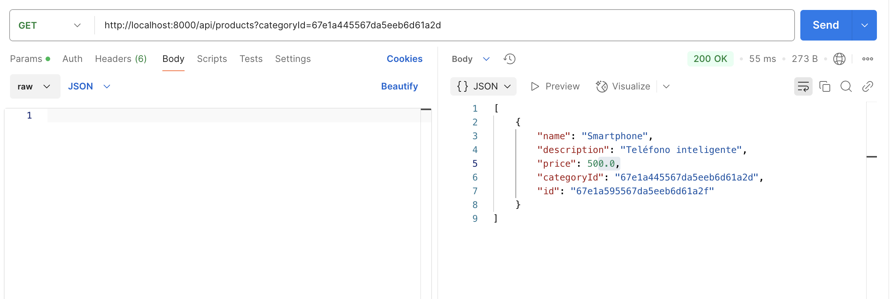
* Añadir un comentario a un producto:
    - Método: `POST`
    - URL: `http://localhost:8000/api/reviews`
    - Cuerpo: `{"productId": "67e1a595567da5eeb6d61a2f", "userId": "60c72b2f9b1d8b3a4c8b4569", "username": "usuario123", "rating": 4.5, "comment": "Muy buen producto, la batería dura bastante."}`
    - Respuesta esperada: `{
        "productId": "67e1a595567da5eeb6d61a2f",
        "userId": "60c72b2f9b1d8b3a4c8b4569",
        "username": "usuario123",
        "rating": 4.5,
        "comment": "Muy buen producto, la batería dura bastante.",
        "id": "67e1a672567da5eeb6d61a30",
        "createdAt": "2025-03-24T18:37:38Z",
        "updatedAt": null
    }`
+
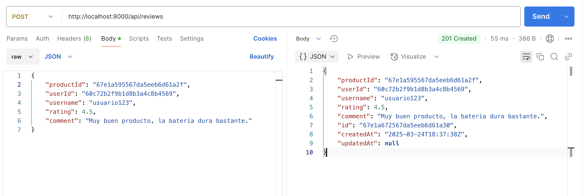
* Obtener los comentarios de un producto:
    - Método: `GET`
    - URL: `http://localhost:8000/api/reviews?productId=67e1a595567da5eeb6d61a2f`
    - Respuesta esperada: Lista de comentarios en formato JSON
* Actualizar un comentario:
    - Método: `PUT`
    - URL: `http://localhost:8000/api/reviews/67e1a672567da5eeb6d61a30`
    - Cuerpo: `{
        "productId": "67e1a595567da5eeb6d61a2f",
        "userId": "60c72b2f9b1d8b3a4c8b4569",
        "username": "usuario123",
        "rating": 4.0,
        "comment": "Muy buen producto, la batería dura bastante."
    }`
    - Respuesta esperada: `{
        "productId": "67e1a595567da5eeb6d61a2f",
        "userId": "60c72b2f9b1d8b3a4c8b4569",
        "username": "usuario123",
        "rating": 4.0,
        "comment": "Muy buen producto, la batería dura bastante.",
        "id": "67e1a6fa567da5eeb6d61a31",
        "createdAt": "2025-03-24T18:39:54Z",
        "updatedAt": "2025-03-24T18:42:32Z"
    }`
+
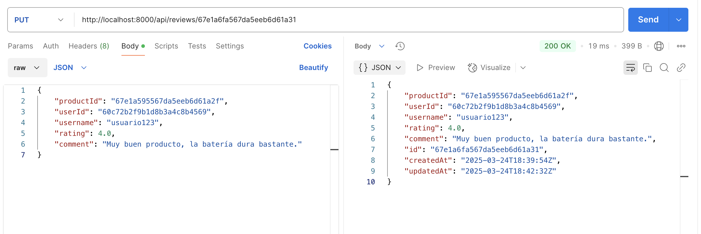
* Eliminar un comentario:
    - Método: `DELETE`
    - URL: `http://localhost:8000/api/reviews/67e1a672567da5eeb6d61a30`
    - Respuesta esperada: `{
        "message": "Review deleted"
    }`
+

* Eliminar un producto:
    - Método: `DELETE`
    - URL: `http://localhost:8000/api/products/67e1a595567da5eeb6d61a2f`
    - Respuesta esperada: `{"message": "Product and associated reviews deleted"}`
+
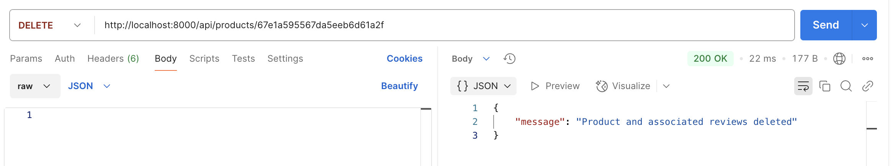
* Eliminar una categoría:
    - Método: `DELETE`
    - URL: `http://localhost:8000/api/categories/67e1a445567da5eeb6d61a2d`
    - Respuesta esperada: `{"message": "Category deleted"}`
+


## Documentación de la API

FastAPI proporciona una interfaz de documentación automática para la API REST, que se genera automáticamente a partir de los modelos de datos y las rutas definidas en la aplicación. La documentación de la API incluye información detallada sobre los endpoints, los parámetros de entrada, los códigos de respuesta y los modelos de datos utilizados. Esta documentación es muy útil para los desarrolladores que consumen la API, ya que les permite comprender rápidamente cómo interactuar con los diferentes endpoints y qué datos esperar en las respuestas. Además, la documentación de la API se actualiza automáticamente a medida que se modifican las rutas y los modelos de datos en la aplicación.

FastAPI utiliza Swagger UI y ReDoc para generar la documentación de la API. Swagger UI proporciona una interfaz interactiva para explorar y probar los endpoints de la API, mientras que ReDoc genera una documentación más legible y visualmente atractiva. Ambas interfaces son accesibles a través de un navegador web y permiten a los desarrolladores interactuar con la API de forma sencilla y eficiente.

Para acceder a la documentación de la API, abre un navegador web y navega a la URL `http://localhost:8000/docs` para Swagger UI o `http://localhost:8000/redoc` para ReDoc. A continuación se muestra la documentación de la API generada automáticamente para Swagger UI.

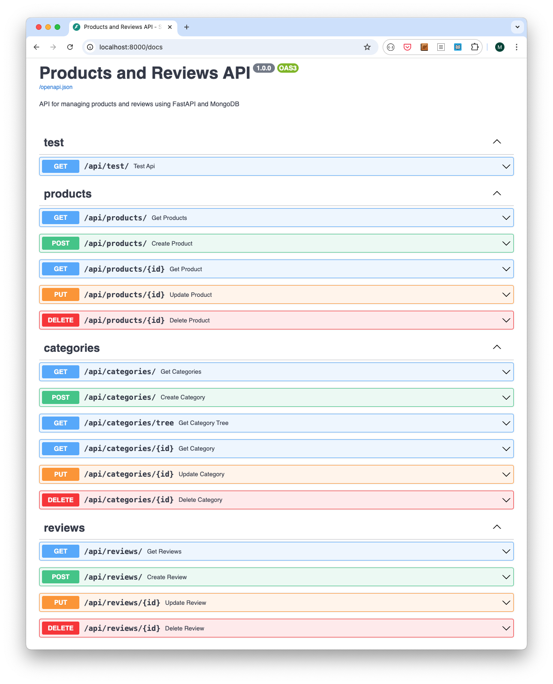

A continuación se muestra la documentación de la API generada automáticamente para ReDoc.

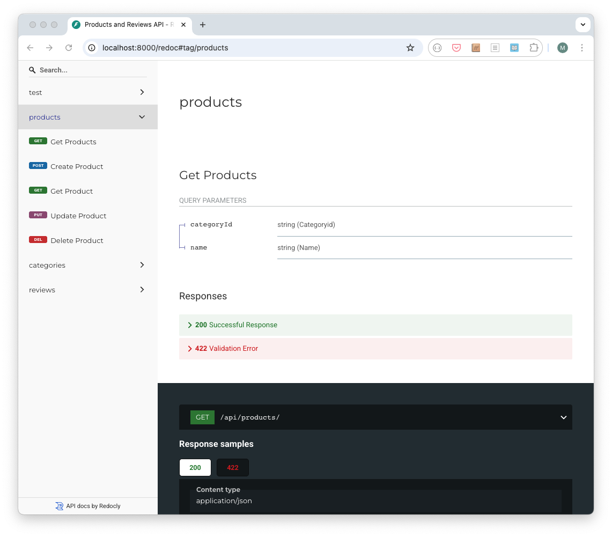

## Conclusiones

En este tutorial, se ha desarrollado una API REST para la gestión de usuarios, productos, categorías y comentarios de una tienda en línea utilizando FastAPI y MySQL. A lo largo del proceso, hemos configurado un entorno de desarrollo con Docker y Docker Compose, implementado los endpoints necesarios para la API REST y probado la API con Postman. 

MySQL es una excelente opción para almacenar datos estructurados, como se ha observado en los usuarios, productos, categorías y comentarios. La combinación de FastAPI y MySQL permite desarrollar aplicaciones web rápidas y eficientes con una arquitectura RESTful. Además, las características de validación de datos de Pydantic y la generación automática de documentación de FastAPI facilitan el desarrollo y la documentación de la API.

Este proyecto no sólo proporciona una solución funcional para la gestión de productos, categorías y comentarios, sino que también sirve como punto de partida para desarrollar aplicaciones web más complejas y escalables. Se pueden añadir más funcionalidades a la API, como la autenticación de usuarios, la gestión de pedidos y la integración con pasarelas de pago.

:numbered!:

## Licencia

Licencia CC BY-NC-ND 4.0

Copyright (c) 2025 [Manuel Torres - Departamento de Informática - Universidad de Almería]

Este proyecto está licenciado bajo la Licencia CC BY-NC-ND 4.0. Esto significa que puedes compartir el proyecto siempre que cites al autor, no lo uses para fines comerciales y no realices obras derivadas.